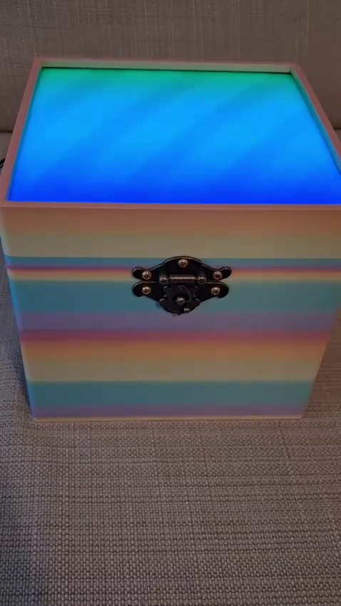
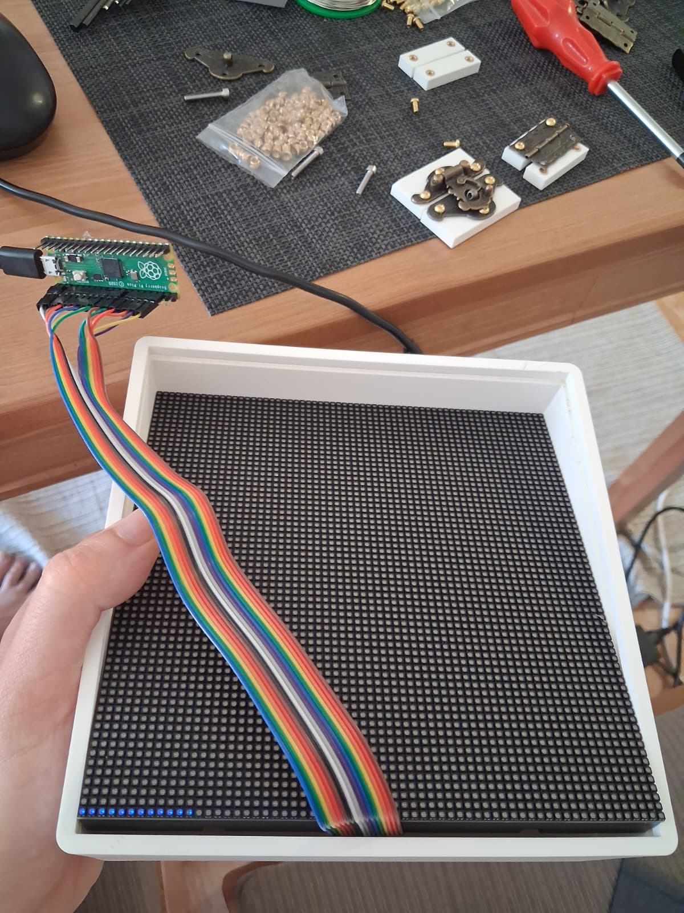
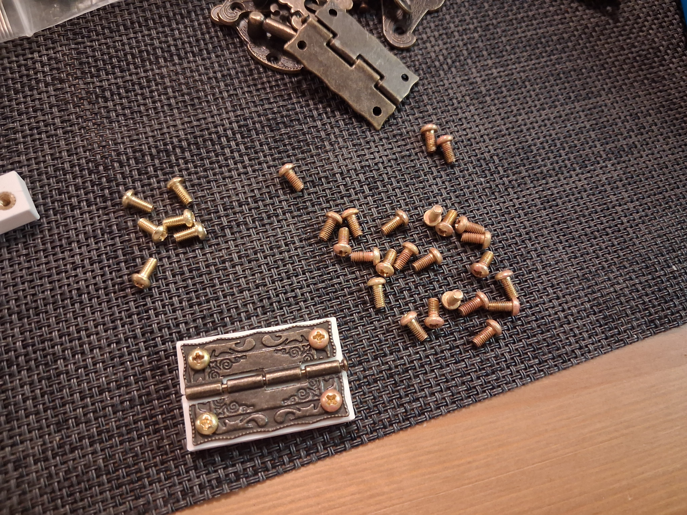
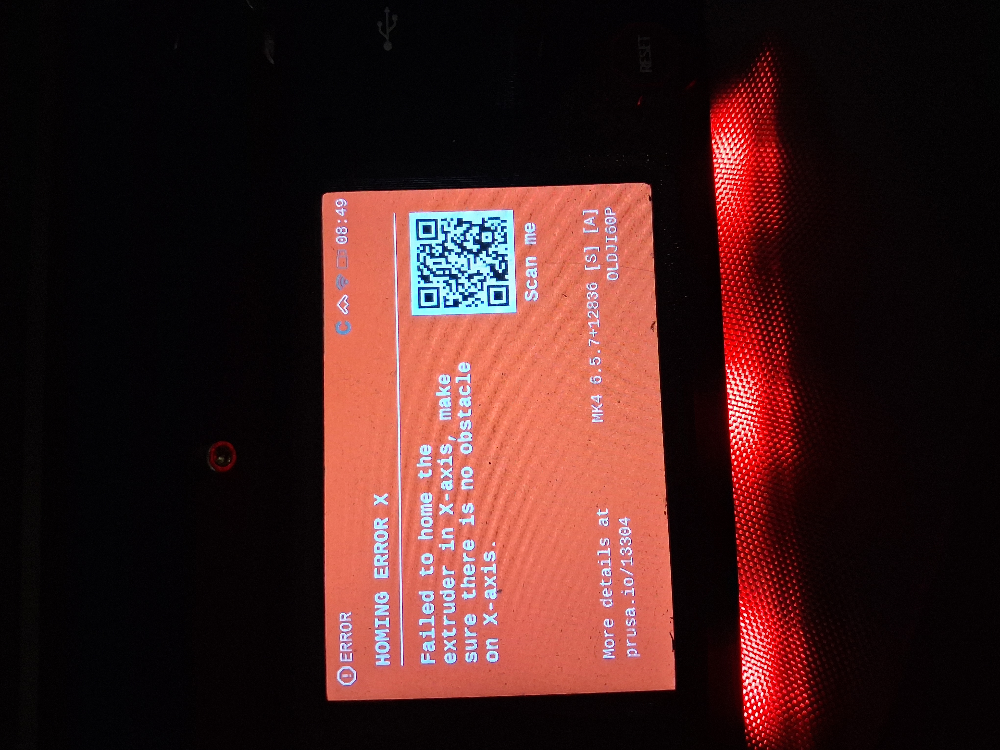
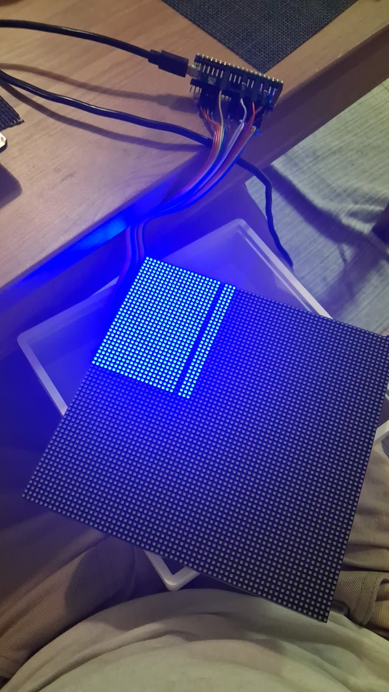
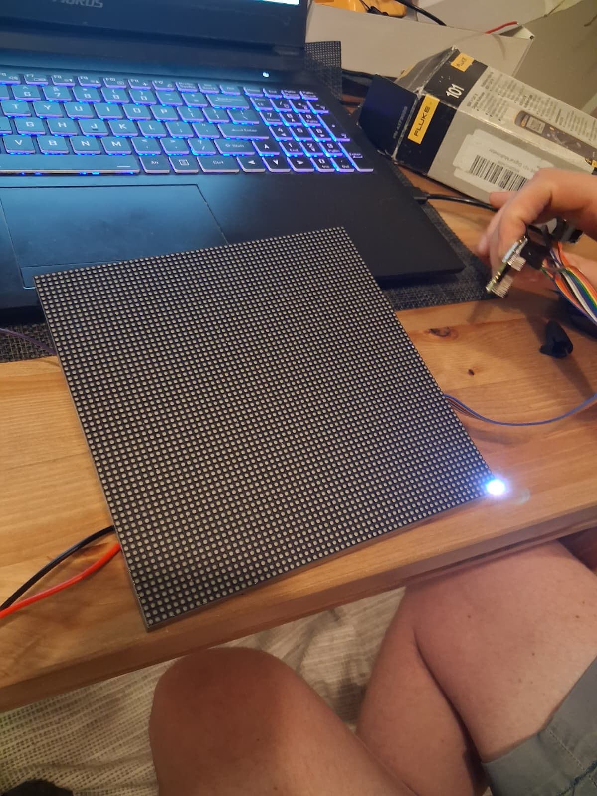

# wedding_box

The wedding box was designed in Fusion360 and fabricated in London at my home lab. It uses Adafruit's circuit  (Adafruit CircuitPython 10.3.0 on 2026-08-31; Raspberry Pi Pico 2 W with rp2350a) and a Pi PICO 2W as the microcontroller. Circuit python is neat software whereby when you plug the microcontroller into a computer a drive gets mounted and you can see the code in text files and modify it. The code that gets uploaded to the box is in the `software/circuitpy` subfolder. Note the filesystem is READONLY for the host computer by default, meaning code cannot be modified by the host computer. This is so that the microcontroller can remember WLAN details sent to it. Documentation and example code for client applications to control the box is in the `software/client` subfolder.

## modifying microcontroller code

Given the filesystem is in READONLY, there are three options to modify code.

1. Use circuit python's serial REPL feature to have the microcontroller modify code.
2. Use circuit python's serial REPL feature to remove the boot.py file (`import os`, `os.remove('boot.py')`) and then re-boot the storage. To put the microcontroller back in READONLY for the host system (to allow the microcontroller to remember WLAN details) you will need to put the `boot.py` file in this repo back onto the circuit python drive.
3. Drive pin GPIO16 to low by connecting it to ground and then unplug the box from power and re-plug it. On boot the fileysystem will be writeable by the host computer. To put the microcontroller back to READONLY for the host system, simply don't drive GPIO16 low and re-boot the microcontroller.

## build process

Some pictures of the build process:  

I did quite a lot of prototyping with a simple frame instead of a box that allowed me to test fit the LED board and cables:  
  

Some prototyping for fitting the hinges where I made smaller pieces with the hole sizes specified and test fittedh inges. You can also see the brass screws before and after the aging. Given the antique hinges I didn't want shiny new brass screws so I aged them with vinegar and salt.

Not all of the 3d Printing went smoothly, see here one of the errors that arose that needed to be fixed (by loosening a belt).
  

I also managed to fry one of the LED boards and when asked to fill the screen with red it only did the below. I had to replace it:  
  

The first light-up of the board was with a friend who has worked a lot with this type of board, and in fact wrote the driver for the prototype from scratch, though I used a different driver to do the more complex display stuff.  
